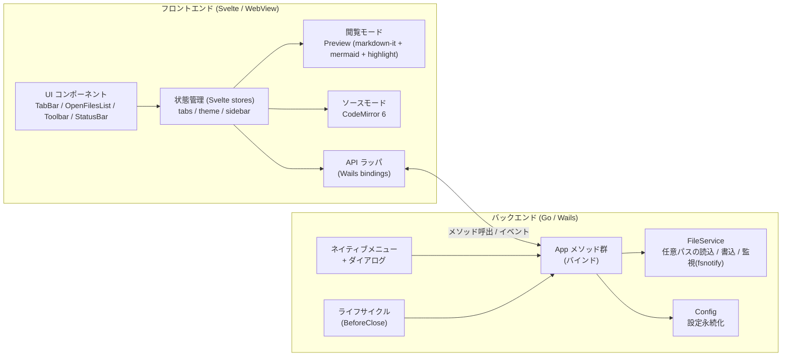
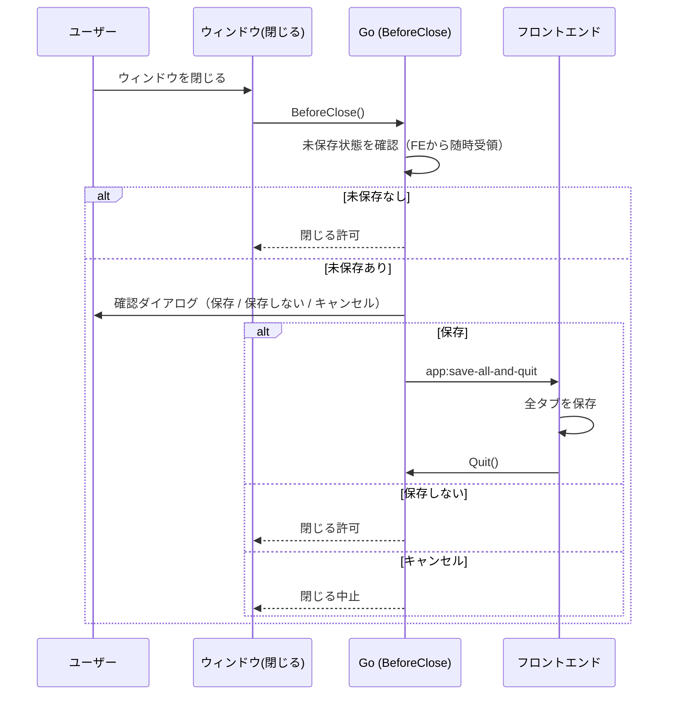
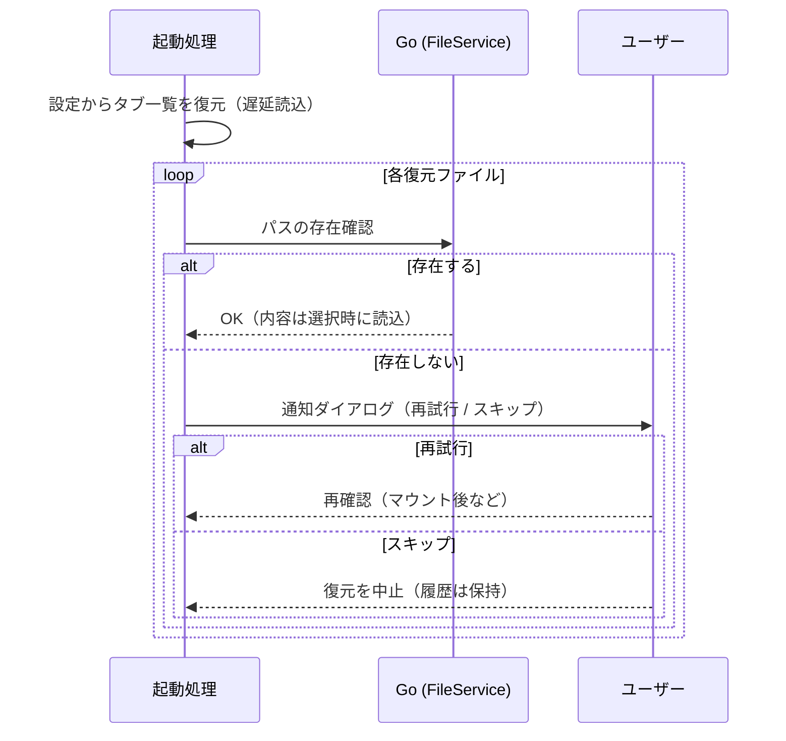

# Markmiru アーキテクチャ・画面設計

最終更新: 2026-05-31

技術スタック・要件は [`技術選定.md`](技術選定.md) を参照。本書は全体アーキテクチャと画面設計を定める。

## 0. 確定した設計方針

| 項目 | 決定 |
|------|------|
| モード切替 | **全画面トグル**（閲覧 ⇄ ソースを丸ごと切替。閲覧重視） |
| ファイルの所在 | **複数の異なるディレクトリを横断**して読み書きする。特定フォルダ配下に限定しない |
| ファイルの開き方 | 個別に開く（ファイルダイアログ／ドラッグ&ドロップ／ファイル関連付け） |
| サイドバー | **「開いている Markdown ファイルの一覧」**（フォルダツリーではない）。タブの**視認性補助**として開閉可 |
| 保存 | **手動保存（Ctrl+S）**。終了時に未保存があれば**確認ダイアログ**（保存／保存しない／キャンセル） |
| Markdown 機能 | **GFM ＋ mermaid**（標準）。数式等の拡張は段階的に追加 |
| 既定モード | 既存ファイルは**常に閲覧モード**で開く。新規作成の空ドキュメントのみソースモード |
| セッション復元 | 起動時に前回のファイル群を**復元**（遅延読込）。不在ファイルは**1件ずつダイアログ（再試行／スキップ）**（§5.6） |
| 外部変更監視 | **後続フェーズ**（初期リリースには含めない） |
| 生 HTML | **安全な HTML は許可**（DOMPurify で危険要素のみ除去） |
| 印刷 / PDF | 既定は印刷向け配色に変換。「表示通りに印刷」で画面通り（§5.5） |

> **サイドバーの位置づけ**: 開いているファイルはタブと一覧の両方に現れる（ほぼ等価）。タブが増えて視認性が落ちた際に、一覧で素早く目的のファイルへ切替えるための補助 UI。異なるディレクトリの同名ファイルを区別できるよう、一覧には**親ディレクトリ等のパス情報**を併記する。

---

## 1. 全体アーキテクチャ

Wails の構造（Go バックエンド ＋ OS 標準 WebView 上の Svelte フロント）に従い、責務を以下に分離する。

- **Go（バックエンド）**: OS に近い処理 — 任意パスのファイル I/O、ファイル監視、ネイティブメニュー、ネイティブダイアログ、ウィンドウ・ライフサイクル、設定の永続化。
- **Svelte（フロントエンド／WebView）**: UI・状態管理・Markdown レンダリング・編集 UI・テーマ。

両者は Wails の **メソッドバインディング**（JS→Go 呼出）と **イベント**（Go→JS 通知）で連携する。



### 1.1 Go 側の責務（バインドメソッド）

| メソッド（例） | 役割 |
|----------------|------|
| `OpenFileDialog()` | ネイティブのファイル選択（複数選択可。任意ディレクトリ） |
| `ReadFile(path)` | 任意パスのファイル読込（文字列返却） |
| `WriteFile(path, content)` | 任意パスへの書込（保存） |
| `SaveFileDialog(suggestedName)` | 「名前を付けて保存」先の取得 |
| `WatchFile(path)` / `UnwatchFile(path)` | 開いているファイルの外部変更監視（fsnotify） |
| `SetDirtyState(summary)` | フロントから未保存状態を随時通知（終了時判定に使用） |
| `GetConfig()` / `SaveConfig(cfg)` | 設定の取得・保存 |
| `Quit()` | アプリ終了 |

Go→フロントのイベント（例）: `file:opened`（OS の関連付け等から開かれたファイル）、`file:changed`（外部変更検知）、`menu:<action>`（メニュー操作）、`app:save-all-and-quit`（終了時の一括保存指示）。

> ディレクトリ走査（`ListDir`）やフォルダ監視は**不要**。サイドバー一覧は「開いているファイル」をフロント状態から描画するため、ファイルシステム走査を伴わない。

### 1.2 フロント側の責務

- **状態管理**: Svelte stores で `tabs` / `activeTabId` / `sidebar` / `theme` を保持。
- **サイドバー（開いているファイル一覧）**: `tabs` から派生して描画（独自のデータ源を持たない）。
- **レンダリング**: markdown-it パイプライン（後述）。
- **編集**: CodeMirror 6（Markdown 言語、行番号、簡易ハイライト）。
- **API ラッパ**: Wails バインディングを薄くラップし、UI から呼びやすくする。

---

## 2. データモデル（フロント状態）

```text
Tab {
  id: string                 // 内部 ID
  filePath: string | null    // 任意ディレクトリの絶対パス。null = 無題（新規）
  fileName: string           // 表示名（例: a.md）
  dirHint: string            // 親ディレクトリ等（同名ファイル区別用。例: ~/proj）
  content: string            // 現在の編集内容
  savedContent: string       // 最後に保存した内容（dirty 判定用）
  mode: 'view' | 'source'    // 既定は 'view'
  dirty: boolean             // content !== savedContent
}

AppState {
  tabs: Tab[]                // = 開いているファイル群（タブ／サイドバー一覧の共通ソース）
  activeTabId: string
  sidebar: { open: boolean }  // 一覧の中身は tabs から派生
  theme: 'light' | 'dark' | <customId>
}
```

- タブとサイドバー一覧は**同じ `tabs` を参照**する（二重管理しない）。
- `dirHint` は `filePath` から算出し、**異なるディレクトリの同名ファイルを区別**するために表示する。
- `dirty` の有無が変化したら `SetDirtyState` で Go に通知する。

---

## 3. Markdown レンダリングパイプライン（閲覧モード）

```text
ソース文字列
  └─ markdown-it（GFM: 表 / チェックリスト / 打消し線 / 自動リンク）
        ├─ コードフェンス ```lang  → highlight.js でハイライト
        └─ コードフェンス ```mermaid → プレースホルダ要素として出力
  └─ DOMPurify でサニタイズ（安全な HTML は許可・script 等の危険要素のみ除去）
  └─ プレビュー DOM へ反映
  └─ mermaid.run() でプレースホルダを SVG 描画（サニタイズ後に実行）
```

- **mermaid**: ` ```mermaid ` フェンスを専用ルールで `<div class="mermaid">…</div>` として出力し、DOM 反映後に `mermaid.run()` で描画。テーマ変更時は再描画。
- **サニタイズ順序**: Markdown 由来 HTML は DOMPurify でサニタイズ後、mermaid の SVG は別途描画して注入（mermaid 出力が誤って除去されないようにする）。
- **再描画**: ソース変更時は描画をデバウンス。閲覧モードへ切替時にも最新内容で描画。

---

## 4. 画面設計

### 4.1 ウィンドウ全体（閲覧モード・サイドバー開）

サイドバーは「開いているファイル一覧」。各項目に**ファイル名＋パス情報**と未保存マーク（`*`）を表示し、クリックで該当タブへ切替える。

```text
┌─────────────────────────────────────────────┐
│ ネイティブメニュー（ファイル / 編集 / 表示 / ヘルプ）      │
├──────────────┬──────────────────────────────┤
│ 開いているﾌｧｲﾙ │ [a.md] [b.md*] [c.md] …   [+] │ ← タブバー
│ ──────────── ├──────────────────────────────┤
│▶ a.md         │ [☰閲覧 | ソース]          [PDF][⚙]│ ← ツールバー
│   ~/proj      ├──────────────────────────────┤
│  b.md  *      │                              │
│   ~/docs      │      レンダリング表示          │
│  c.md         │      （閲覧モード）            │
│   ~/notes     │                              │
│              ├──────────────────────────────┤
│              │ 文字数:1234   UTF-8   ● 保存済  │ ← ステータスバー
└──────────────┴──────────────────────────────┘
```

- `▶` は選択中（アクティブ）のファイル。`*` は未保存。
- 同名ファイルでも `~/proj` `~/docs` 等のパス併記で区別できる。
- サイドバーは開閉可（`Ctrl+B`）。閉じるとコンテンツが全幅になる。タブが少なければ閉じたままでも支障ない。

### 4.2 ソースモード（サイドバー閉）

```text
┌─────────────────────────────────────────────┐
│ ネイティブメニュー                              │
├─────────────────────────────────────────────┤
│ [a.md] [b.md*]                            [+] │
├─────────────────────────────────────────────┤
│ [閲覧 | ☰ソース]                       [PDF] [⚙]│
├─────────────────────────────────────────────┤
│  1 │ # 見出し                                 │
│  2 │                                          │ ← CodeMirror 6
│  3 │ ```mermaid                               │   （行番号＋ハイライト）
│  4 │ graph TD; A-->B;                         │
│  5 │ ```                                      │
├─────────────────────────────────────────────┤
│ 行:3 列:5   文字数:1234   UTF-8   ● 未保存      │
└─────────────────────────────────────────────┘
```

### 4.3 主なコンポーネント構成（Svelte）

```text
App.svelte
├─ MenuBar（ネイティブメニューは Go 側。フロントはイベント受信）
├─ OpenFilesList.svelte  … 開いているファイル一覧（tabs から派生・開閉）
├─ TabBar.svelte         … タブ一覧・追加・閉じる
├─ Toolbar.svelte        … モード切替トグル / PDF / 設定
├─ ContentPane.svelte
│   ├─ Preview.svelte    … 閲覧モード（レンダリング）
│   └─ Editor.svelte     … ソースモード（CodeMirror 6）
└─ StatusBar.svelte      … 文字数・エンコーディング・保存状態
```

---

## 5. 主要フロー

### 5.1 ファイルを開く（複数ディレクトリ横断）

1. メニュー「開く」（複数選択可）／ドラッグ&ドロップ／OS のファイル関連付け。
2. Go `ReadFile(path)` で内容取得（パスは任意ディレクトリ）。
3. 既に同じ `filePath` のタブがあれば activate、なければ新規タブを追加（**既定 `mode='view'`**、`savedContent=content`、`dirHint` を算出）。
4. タブとサイドバー一覧の双方に反映（同一 `tabs` を参照）。

> **既定モード**: 既存ファイルは**常に閲覧モード**で開く。**新規作成の空ドキュメントのみ**、編集が目的のため**ソースモード**で開く。
> **外部変更監視**（`WatchFile`）は後続フェーズのため初期リリースには含めない（§5.4）。

### 5.2 保存（Ctrl+S）

1. `filePath` が `null`（無題）なら Go `SaveFileDialog` で保存先取得（任意ディレクトリ）。
2. Go `WriteFile(path, content)`。
3. `savedContent = content`、`dirty=false`、タブ／一覧の `*` を消す。

### 5.3 終了時の未保存確認

フロントは `dirty` 変化のたびに Go へ未保存状態を通知しておく。ウィンドウの閉じる操作は Go の `BeforeClose` で捕捉する。



### 5.4 外部変更の検知（後続フェーズ）

> **初期リリースには含めない。** 後続フェーズで追加予定。

（将来案）Go の fsnotify が変更を検知 → `file:changed` イベント。フロントは、当該タブが未保存でなければ自動再読込、未保存なら競合の確認を表示。

### 5.5 PDF 出力 / 印刷

WebView の印刷機能（`window.print()`）＋**印刷用 CSS（`@media print`）** を用い、OS の「PDF として保存」で出力する（外部依存なし・クロスプラットフォーム）。

- **配色は既定で印刷向けに変換**（紙=白背景・濃色文字）。組版（フォント/サイズ/余白）はアクティブなプロファイルを継承する。
- オプション「**表示通りに印刷**」を ON にした場合のみ、画面の配色（Dark の暗背景含む）を忠実に再現する。
- 詳細は [`スタイル設定設計.md`](スタイル設定設計.md) §5.2 を参照。

※ 将来、Windows の WebView2 `PrintToPdf` 等による無確認エクスポートを追加検討。

### 5.6 起動時のセッション復元

前回開いていた**ファイル群（パス一覧）を起動時に再オープン**する。終了時の未保存確認（§5.3）により、復元対象は**保存済みでパスを持つファイル**のみ（未保存バッファの保持は不要）。

- **遅延読込**: タブ一覧（パス・並び・アクティブタブ）は即座に復元し、各ファイルの内容は**タブ選択時に読み込む**ことで起動速度を維持。
- **不在ファイルの扱い**: 復元時にパスが存在しない場合、**ファイル1件ごとに通知ダイアログ**を表示し、ユーザーが選択する。
  - **再試行**: 再度パスの存在を確認（ファイルサーバーのマウント忘れ等を想定）。見つかれば開き、まだ無ければ再度ダイアログ。
  - **スキップ**: そのファイルの復元を諦める（最近開いたファイル履歴には残す）。
- **クラッシュ（異常終了）時**の未保存内容は失われる（自動保存はしない方針のため）。クラッシュ復旧は将来課題。



---

## 6. スタイル／テーマ（SHOULD）

閲覧モードのスタイルは**構造化プロファイル(JSON) ＋ CSS 変数**で表現し、細かなパラメータ調整とクロスプラットフォーム同一表示を両立する。詳細は [`スタイル設定設計.md`](スタイル設定設計.md) を参照。要点:

- 本文・見出し(h1〜h6)・コード・引用・リスト・表など**Markdown 表示の各パラメータを細かく調整**可能（CSS 変数に対応）。
- **同梱フォント**で OS 間の表示一致を担保（システムフォントも選択可。選択時は差異が出る旨を明示）。
- 編集は **GUI 設定パネル ＋ カスタム CSS** の2層。適用は**グローバル**（アクティブな1プロファイルを全ドキュメントへ）。
- Light / Dark はプロファイル内の配色プリセット。mermaid テーマも連動。
- プロファイルは保存・**エクスポート/インポート**可能（可搬性）。PDF 出力も同じプロファイルから生成。

---

## 7. 設定の永続化

OS の設定ディレクトリ（Go: `os.UserConfigDir`）に保存。

- 最近開いたファイル（複数ディレクトリ横断の履歴）
- テーマ、サイドバー開閉状態、ウィンドウサイズ
- セッション復元用情報: 前回開いていたファイルのパス一覧・並び・アクティブタブ（§5.6 で復元）

---

## 8. プロジェクト構成（予定）

```text
Markmiru/
├─ wails.json
├─ go.mod
├─ main.go                 # Wails 起動・メニュー・ライフサイクル
├─ app.go                  # App 構造体: バインドメソッド
├─ internal/
│  ├─ fileservice/         # 任意パスの読込/書込（監視は後続フェーズ）
│  └─ config/              # 設定永続化
├─ frontend/
│  ├─ index.html
│  ├─ vite.config.ts
│  ├─ src/
│  │  ├─ main.ts
│  │  ├─ App.svelte
│  │  ├─ lib/
│  │  │  ├─ components/    # TabBar / OpenFilesList / Toolbar / StatusBar / Preview / Editor
│  │  │  ├─ stores/        # tabs / theme / sidebar
│  │  │  ├─ markdown/      # markdown-it 設定 / mermaid / highlight / sanitize
│  │  │  └─ api/           # Wails バインディングのラッパ
│  │  └─ styles/           # テーマ CSS
│  └─ wailsjs/             # 自動生成バインディング
└─ docs/
   ├─ 技術選定.md
   ├─ アーキテクチャ・画面設計.md
   └─ スタイル設定設計.md
```

---

## 9. ショートカット／メニュー（案）

| メニュー | 項目（ショートカット） |
|----------|------------------------|
| ファイル | 開く(Ctrl+O) / 保存(Ctrl+S) / 名前を付けて保存(Ctrl+Shift+S) / PDF出力 / 終了 |
| 編集 | 元に戻す / やり直し / 切り取り / コピー / 貼り付け / 検索(Ctrl+F)（ソースモード） |
| 表示 | 閲覧/ソース切替(Ctrl+E) / サイドバー(Ctrl+B) / テーマ / 拡大・縮小 |
| ヘルプ | バージョン情報 |

---

## 10. 論点の状況

### 解決済み
1. **既定モード** → 既存ファイルは常に閲覧モード／新規空ドキュメントのみソースモード（§5.1）。
2. **PDF 出力方式** → `window.print()` ベース。配色は既定で印刷向けに変換、「表示通りに印刷」で画面通り（§5.5）。
3. **セッション復元** → 復元する（遅延読込）。不在ファイルは1件ずつダイアログ（再試行／スキップ）（§5.6）。
4. **外部変更監視** → 後続フェーズ（初期リリースには含めない）（§5.4）。
5. **サイドバー一覧の表示内容** → ファイル名＋親ディレクトリ＋フルパスのツールチップ。
6. **テーマのプリセット** → ライト / ダーク / GitHub 風 / セピア（[`スタイル設定設計.md`](スタイル設定設計.md)）。
7. **HTML 直書き** → 安全な HTML は許可（DOMPurify で危険要素のみ除去）（§3）。

8. **ソースモード（CodeMirror エディタ）の外観** → 確定（[`スタイル設定設計.md`](スタイル設定設計.md) §9）。控えめな構文ハイライト／Light・Dark 連動／等幅固定（サイズのみ可）／既定で行番号・ソフトラップ。

### 未着手（実装時に調整・将来フェーズ）
- 各標準プリセットの具体的な配色値（実装時に調整）。
- 無確認 PDF エクスポート、外部変更監視、クラッシュ復旧（いずれも将来フェーズ）。
