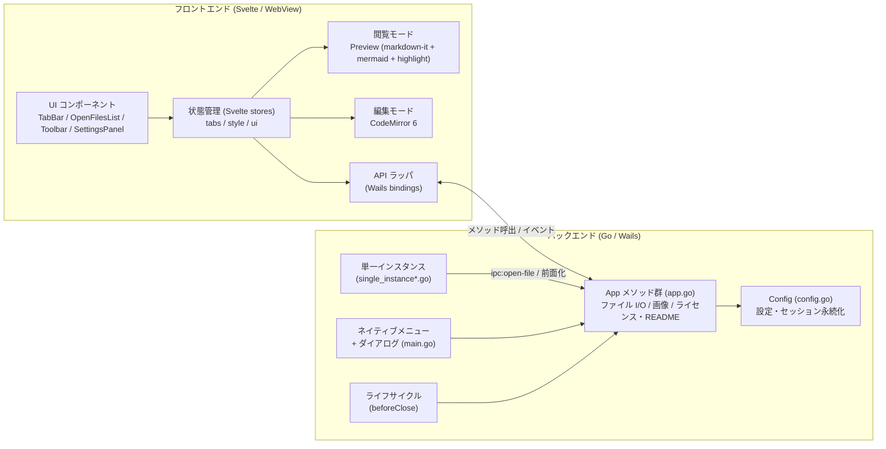
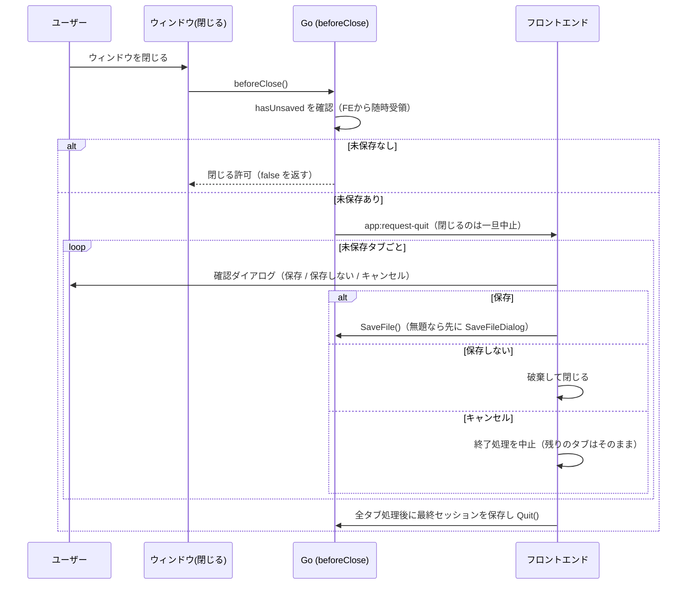

# Markmiru アーキテクチャ・画面設計

最終更新: 2026-06-09

技術スタック・要件は [`技術選定.md`](技術選定.md) を参照。本書は全体アーキテクチャと画面設計を定める。

## 0. 確定した設計方針

| 項目 | 決定 |
|------|------|
| モード切替 | **全画面トグル**（閲覧 ⇄ 編集を丸ごと切替。閲覧重視） |
| ファイルの所在 | **複数の異なるディレクトリを横断**して読み書きする。特定フォルダ配下に限定しない |
| ファイルの開き方 | 個別に開く（ファイルダイアログ／ドラッグ&ドロップ／ファイル関連付け） |
| サイドバー | **「開いている Markdown ファイルの一覧」**（フォルダツリーではない）。タブの**視認性補助**として開閉可 |
| 保存 | **手動保存（Ctrl+S）**。終了時に未保存があれば**確認ダイアログ**（保存／保存しない／キャンセル） |
| Markdown 機能 | **GFM ＋ mermaid**（標準）。数式等の拡張は段階的に追加 |
| 既定モード | 既存ファイルは**常に閲覧モード**で開く。新規作成の空ドキュメントのみ編集モード |
| セッション復元 | 起動時に前回のファイル群を**復元**（遅延読込）。不在ファイルは**1件ずつダイアログ（再試行／スキップ）**（§5.6） |
| 外部変更監視 | **後続フェーズ**（初期リリースには含めない） |
| 生 HTML | **安全な HTML は許可**（DOMPurify で危険要素のみ除去） |
| 印刷 / PDF | 既定は印刷向け配色に変換。「表示通りに印刷」で画面通り（§5.5） |
| 多重起動 | **単一インスタンス**。2 つ目の起動は既存ウィンドウへファイルを渡し前面化（§5.7） |
| 画像 | ローカルパス（相対・絶対・ルート相対）を data URI 化して表示。外部（リモート）画像は**ファイルごとに表示可否を確認**（§5.8） |
| 埋め込みドキュメント | ヘルプ→「ライセンス...」/「Markmiru について...」で同梱 `LICENSE.md` / `README.md` を**編集不可（readOnly）タブ**として表示（§5.9）。専用 About 画面は設けず README で代替 |

> **サイドバーの位置づけ**: 開いているファイルはタブと一覧の両方に現れる（ほぼ等価）。タブが増えて視認性が落ちた際に、一覧で素早く目的のファイルへ切替えるための補助 UI。異なるディレクトリの同名ファイルを区別できるよう、一覧には**親ディレクトリ等のパス情報**を併記する。

---

## 1. 全体アーキテクチャ

Wails の構造（Go バックエンド ＋ OS 標準 WebView 上の Svelte フロント）に従い、責務を以下に分離する。

- **Go（バックエンド）**: OS に近い処理 — 任意パスのファイル I/O、ローカル画像の data URI 化、ネイティブメニュー、ネイティブダイアログ、ウィンドウ・ライフサイクル、単一インスタンス（IPC）、設定・セッションの永続化。（ファイル監視は後続フェーズ・未実装）
- **Svelte（フロントエンド／WebView）**: UI・状態管理・Markdown レンダリング・編集 UI・スタイル。

両者は Wails の **メソッドバインディング**（JS→Go 呼出）と **イベント**（Go→JS 通知）で連携する。



### 1.1 Go 側の責務（バインドメソッド）

実装は `app.go` / `config.go`（薄い層）。

| メソッド | 役割 |
|----------|------|
| `OpenFiles()` | ネイティブのファイル選択（複数選択可。任意ディレクトリ）。`[]FileDoc` を返す |
| `ReadFile(path)` | 任意パスのファイル読込（`FileDoc` を返す） |
| `SaveFile(path, content)` | 任意パスへの書込（保存。`FileDoc` を返す） |
| `SaveFileDialog(suggestedName)` | 「名前を付けて保存」先の取得 |
| `ExportStyleDialog(suggestedName)` | スタイル書き出し用の保存先取得（`*.json` フィルタ。書込は `SaveFile`） |
| `ImportStyleDialog()` | スタイル読み込み用のファイル選択（単一）。選んだファイル内容を返す |
| `ReadImageAsDataURL(baseDir, src)` | ローカル画像を読み、data URI 化して返す（§5.8） |
| `ReadLicense()` | 同梱ライセンス文書（`LICENSE.md`、`//go:embed`）の内容を返す（§5.9） |
| `ReadReadme()` | 同梱 README（`README.md`、`//go:embed`）の内容を返す。About 代わり（§5.9） |
| `SetDirtyState(hasUnsaved bool)` | フロントから未保存有無を随時通知（終了時判定に使用） |
| `ClipboardGetText()` / `ClipboardSetText(text)` | OS クリップボードの取得・書込（右クリックメニューのコピー/貼り付け用。ブラウザ API 制限の回避） |
| `LoadConfig()` / `SaveConfig(cfg)` | 設定の取得・保存（`config.go`） |
| `GetPendingFiles()` | 起動時/IPC で受け取った未処理ファイルパスを取得（§5.7） |
| `FocusWindow()` / `Quit()` | ウィンドウ前面化 / アプリ終了 |

Go→フロントのイベント: `ipc:open-file`（後発インスタンスから転送されたファイルを開く。§5.7）、`menu:<action>`（メニュー操作。例: `menu:new` `menu:open` `menu:save` `menu:saveAs` `menu:print` `menu:style-import` `menu:style-export` `menu:toggleMode` `menu:toggleSidebar` `menu:license` `menu:about`）、`app:request-quit`（終了要求 → フロントが未保存確認の上で `Quit()`）。

> 外部変更監視（fsnotify、`WatchFile` 等）は**後続フェーズ**のため未実装（§5.4）。ディレクトリ走査（`ListDir`）やフォルダ監視も**不要**。サイドバー一覧は「開いているファイル」をフロント状態から描画するため、ファイルシステム走査を伴わない。

### 1.2 フロント側の責務

- **状態管理**: Svelte stores で `tabs` / `activeTabId` / `sidebar` / `theme` を保持。
- **サイドバー（開いているファイル一覧）**: `tabs` から派生して描画（独自のデータ源を持たない）。
- **レンダリング**: markdown-it パイプライン（後述）。
- **編集**: CodeMirror 6（Markdown 言語、行番号、簡易ハイライト）。
- **API ラッパ**: Wails バインディングを薄くラップし、UI から呼びやすくする。

---

## 2. データモデル（フロント状態）

実装は `frontend/src/lib/stores/tabs.ts`（`Tab` 型）／`tabs.svelte.ts`（ストア）。

```text
Tab {
  id: string                 // 内部 ID
  filePath: string | null    // 任意ディレクトリの絶対パス。null = 無題（新規）
  fileName: string           // 表示名（例: a.md）
  dirHint: string            // 親ディレクトリ等（同名ファイル区別用。例: ~/proj）
  content: string            // 現在の編集内容
  savedContent: string       // 最後に保存した内容（dirty 判定用）
  mode: 'view' | 'source'    // 既定は 'view'
  readOnly?: boolean         // 編集不可タブ（例: ライセンス表示）。編集モード・保存を無効化
  remoteImagePolicy?: 'allow' | 'block'  // 外部画像の表示ポリシー（未設定=遮断。§5.8）
}
// dirty はフィールドではなく isDirty(tab) = content !== savedContent で派生。

AppState {
  tabs: Tab[]                // = 開いているファイル群（タブ／サイドバー一覧の共通ソース）
  activeTabId: string
  sidebar: { open: boolean }  // 一覧の中身は tabs から派生（uiStore）
  スタイル: アクティブな Style（styleStore。テーマはスタイル内 colorScheme）
}
```

- タブとサイドバー一覧は**同じ `tabs` を参照**する（二重管理しない）。
- `dirHint` は `filePath` から算出し、**異なるディレクトリの同名ファイルを区別**するために表示する。
- `isDirty` の有無が変化したら `SetDirtyState(hasUnsaved)` で Go に通知する。
- `readOnly` タブ（ライセンス等）は `filePath=null` で開き、セッションには保存しない（§5.9）。

---

## 3. Markdown レンダリングパイプライン（閲覧モード）

```text
ソース文字列
  └─ markdown-it（GFM: 表 / チェックリスト / 打消し線 / 自動リンク）
        ├─ コードフェンス ```lang  → highlight.js でハイライト
        └─ コードフェンス ```mermaid → プレースホルダ要素として出力
  └─ DOMPurify でサニタイズ（安全な HTML は許可・script 等の危険要素のみ除去）
  └─ プレビュー DOM へ反映
  └─ mermaid.run() でプレースホルダを SVG 描画（サニタイズ後に実行）
```

- **mermaid**: ` ```mermaid ` フェンスを専用ルールで `<div class="mermaid">…</div>` として出力し、DOM 反映後に `mermaid.run()` で描画。テーマ変更時は再描画。
- **サニタイズ順序**: Markdown 由来 HTML は DOMPurify でサニタイズ後、mermaid の SVG は別途描画して注入（mermaid 出力が誤って除去されないようにする）。
- **再描画**: ソース変更時は描画をデバウンス。閲覧モードへ切替時にも最新内容で描画。
- **画像**: ローカル画像は data URI 化、外部画像はファイルごとに表示確認（§5.8）。
- **外部リンク**: クリック時に確認ダイアログ（§5.11）を挟み、許可されたら `BrowserOpenURL` で OS ブラウザへ委譲（`links.ts`）。本番ビルドでは CSP（`script-src 'self'` 等）を注入。

---

## 4. 画面設計

### 4.1 ウィンドウ全体（閲覧モード・サイドバー開）

サイドバーは「開いているファイル一覧」。各項目に**ファイル名＋パス情報**と未保存マーク（`*`）を表示し、クリックで該当タブへ切替える。

```text
┌─────────────────────────────────────────────┐
│ ネイティブメニュー（ファイル / 編集 / 表示 / ヘルプ）      │
├──────────────┬──────────────────────────────┤
│ 開いているﾌｧｲﾙ │ [a.md] [b.md*] [c.md] …   [+] │ ← タブバー
│ ──────────── ├──────────────────────────────┤
│▶ a.md         │ [☰閲覧 | 編集]          [PDF][⚙]│ ← ツールバー
│   ~/proj      ├──────────────────────────────┤
│  b.md  *      │                              │
│   ~/docs      │      レンダリング表示          │
│  c.md         │      （閲覧モード）            │
│   ~/notes     │                              │
│              ├──────────────────────────────┤
│              │ 文字数:1234   UTF-8   ● 保存済  │ ← ステータスバー
└──────────────┴──────────────────────────────┘
```

- `▶` は選択中（アクティブ）のファイル。`*` は未保存。
- 同名ファイルでも `~/proj` `~/docs` 等のパス併記で区別できる。
- サイドバーは開閉可（`Ctrl+B`）。閉じるとコンテンツが全幅になる。タブが少なければ閉じたままでも支障ない。

### 4.2 編集モード（サイドバー閉）

```text
┌─────────────────────────────────────────────┐
│ ネイティブメニュー                              │
├─────────────────────────────────────────────┤
│ [a.md] [b.md*]                            [+] │
├─────────────────────────────────────────────┤
│ [閲覧 | ☰編集]                        [PDF] [⚙]│
├─────────────────────────────────────────────┤
│  1 │ # 見出し                                 │
│  2 │                                          │ ← CodeMirror 6
│  3 │ ```mermaid                               │   （行番号＋ハイライト）
│  4 │ graph TD; A-->B;                         │
│  5 │ ```                                      │
├─────────────────────────────────────────────┤
│ 行:3 列:5   文字数:1234   UTF-8   ● 未保存      │
└─────────────────────────────────────────────┘
```

### 4.3 主なコンポーネント構成（Svelte）

実装は `frontend/src/lib/components/`（ネイティブメニューは Go 側。フロントは `menu.ts` でイベント受信）。

```text
App.svelte
├─ OpenFilesList.svelte  … 開いているファイル一覧（tabs から派生・開閉）
├─ TabBar.svelte         … タブ一覧・追加・閉じる
├─ Toolbar.svelte        … モード切替トグル / 本文最大幅 / PDF / 設定
├─ Preview.svelte        … 閲覧モード（markdown-it レンダリング）
├─ Editor.svelte         … 編集モード（CodeMirror 6）
├─ SettingsPanel.svelte  … スタイル設定パネル（ColorField.svelte を内包）
├─ ConfirmDialog.svelte  … 確認ダイアログ（終了時の未保存確認・外部画像確認・インポート上書き確認 等）
├─ ExportPickerDialog.svelte … エクスポート対象スタイルの選択（プリセットはグレー表示）
├─ LinkOpenDialog.svelte … 外部リンクを開く前の確認（[はい]はポインタのみ・起動遅延。§5.11）
└─ ContextMenu.svelte    … 両モードの右クリックメニュー（コピー/貼り付け/リンクのコピー 等）
```

> 専用の `StatusBar` コンポーネントは未実装（後述の §4.1 / §4.2 のステータスバーは将来案）。`ContentPane` は設けず、`App.svelte` が `Preview` / `Editor` を直接切替える。

---

## 5. 主要フロー

### 5.1 ファイルを開く（複数ディレクトリ横断）

1. メニュー「開く」（複数選択可）／ドラッグ&ドロップ／OS のファイル関連付け。
2. Go `ReadFile(path)` で内容取得（パスは任意ディレクトリ）。
3. 既に同じ `filePath` のタブがあれば activate、なければ新規タブを追加（**既定 `mode='view'`**、`savedContent=content`、`dirHint` を算出）。
4. タブとサイドバー一覧の双方に反映（同一 `tabs` を参照）。

> **既定モード**: 既存ファイルは**常に閲覧モード**で開く。**新規作成の空ドキュメントのみ**、編集が目的のため**編集モード**で開く。
> **外部変更監視**（`WatchFile`）は後続フェーズのため初期リリースには含めない（§5.4）。

### 5.2 保存（Ctrl+S）

1. `filePath` が `null`（無題）なら Go `SaveFileDialog` で保存先取得（任意ディレクトリ）。
2. Go `SaveFile(path, content)`（`FileDoc` を返す）。
3. `savedContent = content` とし、タブ／一覧の `*`（未保存マーク）を消す。
4. `readOnly` タブ（ライセンス等）では保存系の操作は無効。

### 5.3 終了時の未保存確認

フロントは未保存有無の変化のたびに `SetDirtyState(hasUnsaved)` で Go へ通知しておく。ウィンドウの閉じる操作は Go の `beforeClose` で捕捉する。未保存があれば一旦閉じるのを止め、`app:request-quit` をフロントへ送る。**確認ダイアログはフロント（`ConfirmDialog`）が表示**し、未保存タブを1つずつ 3択（保存／保存しない／キャンセル）で処理する。すべて処理し終えたらフロントが `Quit()` を呼ぶ。



### 5.4 外部変更の検知（後続フェーズ）

> **初期リリースには含めない。** 後続フェーズで追加予定。

（将来案）Go の fsnotify が変更を検知 → `file:changed` イベント。フロントは、当該タブが未保存でなければ自動再読込、未保存なら競合の確認を表示。

### 5.5 PDF 出力 / 印刷

WebView の印刷機能（`window.print()`）＋**印刷用 CSS（`@media print`）** を用い、OS の「PDF として保存」で出力する（外部依存なし・クロスプラットフォーム）。

- **配色は既定で印刷向けに変換**（紙=白背景・濃色文字）。組版（フォント/サイズ/余白）はアクティブなスタイルを継承する。
- オプション「**表示通りに印刷**」を ON にした場合のみ、画面の配色（Dark の暗背景含む）を忠実に再現する。
- 詳細は [`スタイル設定設計.md`](スタイル設定設計.md) §5.2 を参照。

※ 将来、Windows の WebView2 `PrintToPdf` 等による無確認エクスポートを追加検討。

### 5.6 起動時のセッション復元

前回開いていた**ファイル群（パス一覧）を起動時に再オープン**する。終了時の未保存確認（§5.3）により、復元対象は**保存済みでパスを持つファイル**のみ（未保存バッファの保持は不要）。

- **遅延読込**: タブ一覧（パス・並び・アクティブタブ）は即座に復元し、各ファイルの内容は**タブ選択時に読み込む**ことで起動速度を維持。
- **不在ファイルの扱い**: 復元時にパスが存在しない場合、**ファイル1件ごとに通知ダイアログ**を表示し、ユーザーが選択する。
  - **再試行**: 再度パスの存在を確認（ファイルサーバーのマウント忘れ等を想定）。見つかれば開き、まだ無ければ再度ダイアログ。
  - **スキップ**: そのファイルの復元を諦める（最近開いたファイル履歴には残す）。
- **クラッシュ（異常終了）時**の未保存内容は失われる（自動保存はしない方針のため）。クラッシュ復旧は将来課題。


### 5.7 単一インスタンス（多重起動防止）

2 重起動を防ぎ、2 つ目以降の起動は**既存ウィンドウへファイルを渡して前面化**する（実装: `single_instance*.go`、起動引数の受け渡しは `app.go`）。

- **ロック兼 IPC チャネル**: ユーザー固有ディレクトリ（`os.UserCacheDir`）内のソケットで `ensureSingleInstance()` を行う。リスナーを起動できれば先発、既存があれば後発と判定。
- **後発インスタンス**: 開こうとしたファイルパスを IPC で先発へ送信して終了（`os.Exit`）。ペイロードはパス数・長さに上限を設けて検証する。
- **先発インスタンス**: 受信パスを `ipc:open-file` イベントでフロントへ渡し（`openFileByPath`）、ウィンドウを前面化（OS 依存のフォアグラウンド処理）。
- **起動時の引数**: フロント準備前に渡されたファイルは `GetPendingFiles()` で取得して開く。
- プラットフォーム別実装: `single_instance_{windows,darwin,linux,other}.go`。

### 5.8 画像の表示（ローカル / 外部）

信頼できない Markdown を安全に扱うため、画像はソース種別で扱いを分ける（実装: `app.go ReadImageAsDataURL`、`markdown/renderer.ts`）。

- **ローカル画像**（相対・絶対・ルート相対パス）: Go `ReadImageAsDataURL(baseDir, src)` で読み、**data URI 化**して表示。`baseDir` は当該ファイルのディレクトリ。
- **外部（リモート）画像**: 既定では**遮断**してレンダリングし、**ファイルごとに表示可否を確認**（`ConfirmDialog`）。結果は `Tab.remoteImagePolicy`（`allow` / `block`）として保持するが、**セッションには永続化しない**（次回起動時に再確認）。

### 5.9 埋め込みドキュメント表示（ライセンス / About）

ヘルプメニューから、実行バイナリに埋め込んだドキュメントを**編集不可タブ**として表示する。専用の About 画面は設けず、README をその代替とする。

- **ライセンス**: 「ライセンス...」（`menu:license`）→ `LICENSE.md`（Markmiru 本体＋サードパーティを統合）を `//go:embed` で埋め込み、`ReadLicense()` で取得 → `openLicense()`。
- **About（README）**: 「Markmiru について...」（`menu:about`）→ `README.md`（概要・機能一覧等）を `//go:embed` で埋め込み、`ReadReadme()` で取得 → `openReadme()`。
- いずれも別ファイルの配置は不要。`openLicense()` / `openReadme()` は `readOnly: true` のタブで開く（`filePath=null`。一覧にパスは出ず、セッションにも保存されない）。既に開いていればそのタブをアクティブ化する。
- `readOnly` タブは編集モードへ切替えられず、保存系の操作も無効（§2、§5.2）。

### 5.10 右クリックメニュー（両モード）

既定の WebView コンテキストメニューは無効のため、コンテンツ領域（閲覧 `.markdown-body` / 編集 `.cm-editor`）でのみ自前の最小限メニュー（`ContextMenu.svelte`）を出す。ツールバー・ダイアログ等では出さない。

- 項目は**モードごとに固定**（数・並びは状況で変えず、可否のみ切り替える）。ショートカットのある項目は**ショートカットを併記**する。
- **閲覧モード**: コピー（Ctrl+C・選択時）／**リンクのコピー**（`href` の実リンク先。リンク以外で右クリックした場合は**無効**）／すべて選択（Ctrl+A）。**貼り付けは無し**。
- **編集モード（CodeMirror）**: 取り消し（Ctrl+Z）／再実行（Ctrl+Y）／切り取り（Ctrl+X）／コピー（Ctrl+C）／貼り付け（Ctrl+V）／すべて選択（Ctrl+A）。取り消し/再実行は `undoDepth`/`redoDepth` で可否を判定。編集操作は `editorBridge` 経由で取得した `EditorView` の組み込みコマンド（`undo`/`redo`/`selectAll`）またはトランザクション（貼り付け）で行う。
- クリップボードはブラウザ API ではなく **OS（Go runtime）経由**（`ClipboardGetText` / `ClipboardSetText`）。Ctrl+C / Ctrl+V（ブラウザ標準）と同じ OS クリップボードを共有する。
- メニューは Esc・外側クリック・リサイズ・フォーカス喪失で閉じる。

**キーボードショートカットとメニューの挙動統一**: ショートカット（Ctrl+C/V/X/A 等）は元々ブラウザ／CodeMirror の組み込み処理で、メニューは別実装のため、CM 固有の差異を次のように吸収して挙動を揃えている。

- 編集モードの **複数選択／複数カーソル**を無効化（§スタイル設定設計.md §9）。**選択なしのコピー/切り取り**（CM 既定の「現在行コピー」）は抑止し、メニューと同じく「何もしない」に統一。
- 閲覧モードの **コピーはプレーンテキストのみ**（`copy` イベントを横取りして書式を捨てる）。**Ctrl+A は本文（`.markdown-body`）のみ**を選択（ブラウザ既定のページ全体選択を抑止）。メニューの「すべて選択」と同一範囲。
- なお **貼り付けだけはメニューから組み込み経路を再利用できない**（ブラウザがページ主導のクリップボード読取を禁止するため）。メニューの貼り付けは Go クリップボード経由で `EditorView` に挿入する。

### 5.11 外部リンクを開く前の確認ダイアログ

閲覧モードで外部リンク（`http(s)` / `mailto`）をクリックすると、`BrowserOpenURL` で OS の既定アプリへ渡す**前に**確認ダイアログ（`LinkOpenDialog.svelte`）を表示する。許可した場合のみ開く（実装: `links.ts` → `linkDialog.confirm(url)`）。

- **URL を表示**し、何を開くのかを明示する。
- 危険な選択（外部アプリ起動）を伴うため、**Chromium のガイドライン**（Security Considerations for Browser UI）に倣った防御を行う:
  - **[はい]（開く）はポインタ操作のみ**。Enter / Space などキーボードでは発動させない（**keyjacking 対策**。`tabindex=-1` ＋ キー入力の抑止、フォーカスも当てない）。
  - **表示直後 約 500ms は [はい] を無効化**（`disabled`）し、以降クリック可能にする（**clickjacking 対策**＝起動遅延）。
  - **[いいえ]（開かない）は Esc でも実行**でき、初期フォーカスも [いいえ] に置く（安全側の既定）。
- ページ内アンカー（`#...`）や未知スキームは従来どおり（前者は通常遷移、後者はブロック）で、確認対象外。

---

## 6. スタイル（SHOULD）

閲覧モードのスタイルは**構造化スタイル(JSON) ＋ CSS 変数**で表現し、細かなパラメータ調整とクロスプラットフォーム同一表示を両立する。詳細は [`スタイル設定設計.md`](スタイル設定設計.md) を参照。要点:

- 本文・見出し(h1〜h6)・コード・引用・リスト・表など**Markdown 表示の各パラメータを細かく調整**可能（CSS 変数に対応）。
- **同梱フォント**で OS 間の表示一致を担保（システムフォントも選択可。選択時は差異が出る旨を明示）。
- 編集は **GUI 設定パネル ＋ カスタム CSS** の2層。適用は**グローバル**（アクティブな1スタイルを全ドキュメントへ）。
- Light / Dark はスタイル内の配色プリセット。コード／mermaid テーマも `colorScheme` に連動。
- スタイルは保存・複製が可能。PDF 出力も同じスタイルから生成。**ファイルへのエクスポート/インポートにも対応**（メニュー「ファイル → スタイル」。[`スタイル設定設計.md`](スタイル設定設計.md) §6）。

---

## 7. 設定の永続化

OS の設定ディレクトリ（Go: `os.UserConfigDir` → `Markmiru/config.json`）に保存（実装: `config.go` の `Config`）。

- **セッション復元用情報**: 前回開いていたファイルのパス一覧（`session.files`）・アクティブ位置（`activeIndex`）（§5.6 で復元）。
- **サイドバー開閉状態**（`sidebarOpen`）。
- **スタイル**: ユーザー定義スタイル群を JSON 文字列で保持（`stylesJson`）＋アクティブスタイル ID（`activeStyleId`）。テーマ（Light/Dark）はアクティブスタイルの `colorScheme` に含まれる。
- スタイルは Go 側で構造を二重定義せず、フロントの型のまま JSON 文字列として保存する。
- **ウィンドウ状態**: サイズ（`windowWidth` / `windowHeight`）と最大化状態（`windowMaximised`）。起動時に `main.go` が読み込み `options.App` の `Width`/`Height`/`WindowStartState` に反映する。保存は Go 側のみ（`beforeClose` → `saveWindowState`）で、最大化中は通常サイズ（復元サイズ）を上書きしない。フロントの `SaveConfig` はウィンドウ状態の既存値を保持する（0 上書きを防ぐ）。
- 最近開いたファイル履歴（セッションとは別の履歴）は**未保存**（将来拡張）。

---

## 8. プロジェクト構成（実装）

Go はルート直下に薄く配置（`internal/` は設けていない）。

```text
Markmiru/
├─ wails.json                     # Wails 設定。postBuildHooks(darwin/*) で macOS アイコンを .app へ上書き
├─ go.mod
├─ main.go                       # Wails 起動・ネイティブメニュー・ライフサイクル
├─ app.go                        # App 構造体: バインドメソッド・ファイル I/O・画像 data URI 化・ライセンス
├─ config.go                     # 設定の永続化（LoadConfig / SaveConfig）
├─ single_instance.go            # 単一インスタンス（共通: ソケット/IPC）
├─ single_instance_{windows,darwin,linux,other}.go  # プラットフォーム別
├─ LICENSE.md                    # 本体＋サードパーティのライセンス（//go:embed で同梱）
├─ README.md                     # 概要・機能一覧等（//go:embed で同梱。ヘルプ→About で表示）
├─ frontend/
│  ├─ index.html
│  ├─ vite.config.ts
│  ├─ src/
│  │  ├─ main.ts
│  │  ├─ App.svelte
│  │  ├─ lib/
│  │  │  ├─ components/          # TabBar / OpenFilesList / Toolbar / Preview / Editor / SettingsPanel / ColorField / ConfirmDialog / ExportPickerDialog / LinkOpenDialog / ContextMenu
│  │  │  ├─ stores/              # tabs.ts / tabs.svelte.ts / ui.svelte.ts
│  │  │  ├─ markdown/            # renderer.ts（markdown-it + mermaid + DOMPurify）
│  │  │  ├─ style/               # styleDef.ts / style.svelte.ts / fonts.ts / highlight.ts
│  │  │  ├─ styles/              # markdown.css / print.css
│  │  │  ├─ api/                 # Wails バインディングのラッパ（wails.ts）
│  │  │  ├─ commands.ts          # ユーザー操作（開く/保存/印刷/終了/ライセンス/About 等）
│  │  │  ├─ menu.ts              # ネイティブメニュー/IPC イベントの購読
│  │  │  ├─ dialog.svelte.ts     # 確認ダイアログの状態
│  │  │  ├─ stylePicker.svelte.ts # エクスポート対象選択ピッカーの状態
│  │  │  ├─ linkDialog.svelte.ts # 外部リンクを開く前の確認ダイアログの状態
│  │  │  ├─ editorBridge.ts      # 編集モードの EditorView 受け渡し（右クリックメニュー用）
│  │  │  └─ links.ts             # 外部リンクの OS ブラウザ委譲（確認ダイアログ経由）
│  │  └─ assets/
│  └─ wailsjs/                   # 自動生成バインディング
├─ build/                        # Wails ビルド資産（アイコン等）
│  ├─ appicon.png                # 既定アイコン源（macOS は常にここから .icns 生成）
│  ├─ windows/icon.ico           # Windows アプリアイコン（存在すればそのまま埋め込み）
│  └─ darwin/iconfile.icns       # macOS アプリアイコン（postBuildHooks で .app へ上書き）
└─ docs/
   ├─ 技術選定.md / 代替技術調査.md / 利用ライブラリ一覧.md
   ├─ アーキテクチャ・画面設計.md
   └─ スタイル設定設計.md
```

> アイコンの組み込み詳細は [`../AGENTS.md`](../AGENTS.md) 「アプリアイコン」を参照。

---

## 9. ショートカット／メニュー（実装）

ネイティブメニューは `main.go buildMenu()` で構築。

| メニュー | 項目（ショートカット） |
|----------|------------------------|
| ファイル | 新規(Ctrl+N) / 開く(Ctrl+O) / 保存(Ctrl+S) / 名前を付けて保存(Ctrl+Shift+S) / PDF 出力・印刷(Ctrl+P) / スタイル → インポート... ・ エクスポート... / 終了(Ctrl+Q) |
| 編集 | 標準の編集メニュー（元に戻す / やり直し / 切り取り / コピー / 貼り付け 等。Wails `EditMenu()`） |
| 表示 | 閲覧/編集切替(Ctrl+E) / サイドバー(Ctrl+B) |
| ヘルプ | Markmiru について... / ライセンス... |

> スタイル選択／本文最大幅の切替・拡大縮小はネイティブメニューではなく**ツールバー／設定パネル**で提供する（スタイルのインポート/エクスポートのみメニュー「ファイル → スタイル」）。

---

## 10. 論点の状況

### 解決済み
1. **既定モード** → 既存ファイルは常に閲覧モード／新規空ドキュメントのみ編集モード（§5.1）。
2. **PDF 出力方式** → `window.print()` ベース。配色は既定で印刷向けに変換、「表示通りに印刷」で画面通り（§5.5）。
3. **セッション復元** → 復元する（遅延読込）。不在ファイルは1件ずつダイアログ（再試行／スキップ）（§5.6）。
4. **外部変更監視** → 後続フェーズ（初期リリースには含めない）（§5.4）。
5. **サイドバー一覧の表示内容** → ファイル名＋親ディレクトリ＋フルパスのツールチップ。
6. **スタイルのプリセット** → ライト / ダーク / GitHub 風 / セピア（[`スタイル設定設計.md`](スタイル設定設計.md)）。
7. **HTML 直書き** → 安全な HTML は許可（DOMPurify で危険要素のみ除去）（§3）。

8. **編集モード（CodeMirror エディタ）の外観** → 確定（[`スタイル設定設計.md`](スタイル設定設計.md) §9）。控えめな構文ハイライト／Light・Dark 連動／等幅固定（サイズのみ可）／既定で行番号・ソフトラップ。
9. **単一インスタンス（多重起動防止）** → 実装済み。後発の起動は既存へファイルを渡し前面化（§5.7）。
10. **画像の防御** → ローカルは data URI 化、外部はファイルごとに表示確認（§5.8）。
11. **埋め込みドキュメント表示** → ヘルプ→「ライセンス...」/「Markmiru について...」で同梱 `LICENSE.md` / `README.md` を readOnly タブ表示（§5.9）。About は README で代替。

### 未着手（将来フェーズ）
- 無確認 PDF エクスポート、外部変更監視、クラッシュ復旧。
- 配布パッケージ（Windows インストーラ、macOS/Linux）。
