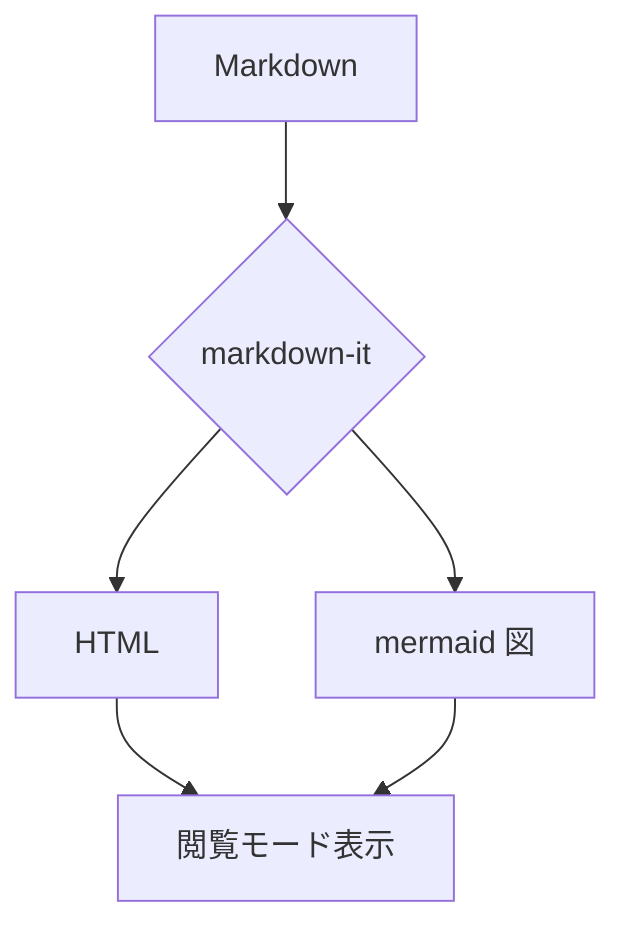

# Markmiru レンダリング確認

これは **Markdown** と *mermaid* の表示テストです。  
テストですったらテストです。

## GFM 機能
- 箇条書き
- [x] 完了タスク
- [ ] 未完了タスク

1. あああ
1. いいい
1. ううう

| 機能 | 状態 |
|------|:----:|
| 表 | OK |
| 打消し線 | ~~対応~~ |

> 引用ブロックの例です。

インラインコード `const x = 1` と、コードブロック:

```js
function greet(name) {
  return `Hello, ${name}!`
}
```

## mermaid 図


